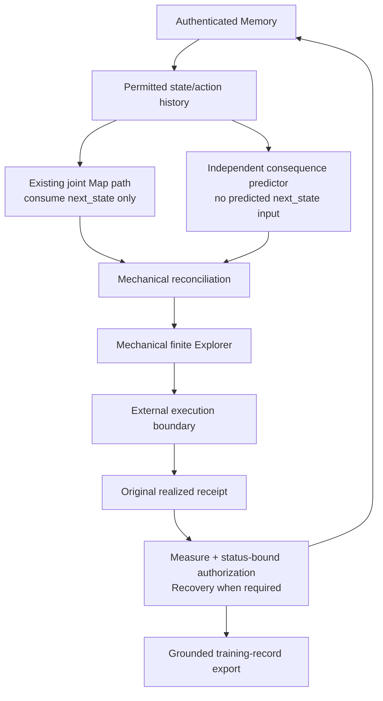

# Horus v0 closed loop

Horus v0 is a minimal runnable composition of the established grounded authority
chain and three replaceable decision interfaces. Run it with:

```sh
python -m horus.run
```

The command writes `horus-v0-run.json` plus an authenticated process-local
checkpoint record and prints a readable two-episode trace.



The default consequence predictor is deliberately small: it takes the sign of
the sum of all authenticated consequences for the exact state/action relation;
untried or balanced histories produce neutral zero. It retains contradictory
observations and does not overwrite history. This is a practical deterministic
adapter for the independent consequence interface, not a claim that the final
Map architecture or a learned model has been established.

The next-state predictor calls the existing joint `MapModel.predict_from` path
and consumes only `next_state`. Its joint consequence is discarded whenever the
independent consequence component is valid. Invalid components cause explicit
Map and Explorer abstention. Explorer compares the three finite consequences in
code. A unique maximum wins; a tie permits one bounded fallback to the first
untried tied action in canonical action order; a tried tie abstains.

The reconciled prediction is installed through a one-decision adapter before the
existing framework begins the transaction. The external boundary alone executes
and mints the original receipt. Existing Measure, status-bound independent
authorization, Recovery and atomic Memory publication then process that receipt.
The application cannot turn a proposal into an observation.

Episode 1 starts in state 1 with empty Memory. All consequences are neutral, so
the bounded fallback selects `ADVANCE`; reality returns consequence −1 and the
authenticated record is published. The trusted two-epoch initialization returns
the current world/Map state to 1 without rewriting Memory. Episode 2 sees the
earlier negative `ADVANCE` record, forecasts `ADVANCE=-1`, and selects untried
`HOLD`. This is the demonstrated causal chain:

`receipt(ADVANCE, −1) → authenticated Memory → later forecast → HOLD`.

The checkpoint file is HMAC-authenticated by a process-local authority and a new
runtime wrapper resumes the same controller, external-source lifetime and
protected objects. It tests application restart while the trusted process stays
alive. Durable cross-process restoration of source capabilities is not claimed
and remains future engineering work.

Each authorized step exports a training record with:

```text
input_context
chosen_action
predicted_next_state
predicted_consequence
realized_next_state
realized_consequence
receipt_identity
authorization_status
memory_identity
memory_reference
```

These records are grounded examples suitable for later dataset construction.
Horus v0 performs no training, weight updates or automatic model calls.
