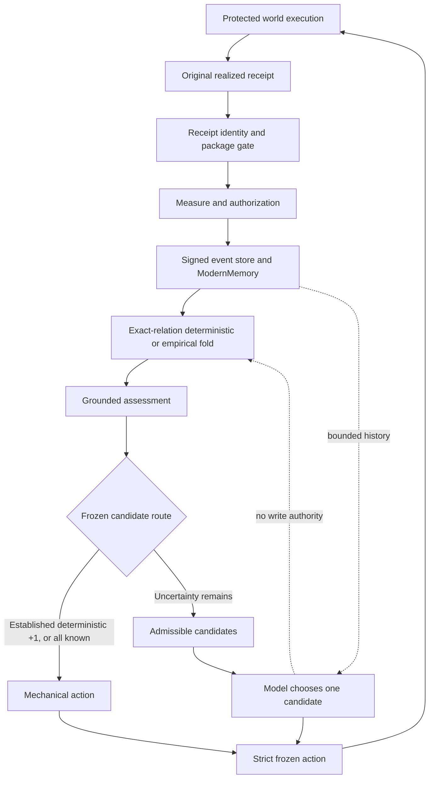

# Authority map (Phase 1)

The protected executor owns realized consequences. The receipt gate checks the *current original object*, binding, and pending identity; Measure and authorization control commit. Only current authorized signed events enter ModernMemory, whose rows feed exact-relation folds. These boundaries prevent model claims, copied receipts, mismatched predictions, or stale events from becoming experience. Their visible costs are bounded protected bookkeeping, durable provenance, and the need to execute a relation to learn it. [Implementation: receipt gate](../../experiments/realized_event_grounding_v0/framework.py), [durable admission](../../experiments/modern_memory_vs_horus_v0/storage.py), [campaign worker](../../experiments/grounded_authority_autonomous_agent_v0/worker.py).

The frozen [`select_route`](../../experiments/grounded_authority_autonomous_agent_v0/protocol.py) gives *mechanical* action authority to an exact deterministic established `+1` (global consequence ceiling), or to the maximum when all actions have established deterministic values. The former can bypass comparison with uncertain alternatives because `+1` is the registered maximum. Otherwise the model has **bounded selection authority** among all uncertain actions plus one best known deterministic action. It has no authority to turn `UNSEEN`, `UNRESOLVED_CHANGE`, or an empirical pattern into an established deterministic value. An inadmissible or unparseable selection stops before world execution.

The model's prompt includes goal, current state, grounded assessments, candidates, and at most three prior decisions; it excludes hidden world regime, future outcomes, and prior self-reviews. A model choice of established zero in a mixed route is labeled `SAFE_GROUNDED_FALLBACK` *after* parsing. That label does not add mechanical authority or establish optimality. The earlier [safe-fallback experiment](../grounded-safe-fallback-v0/report.md) studied a different mechanical H_SAFE rule and cannot be substituted for this route.

In A/B, established `+1` caused mechanical choices, e.g. A:D06 and B:D16 in the [public trajectory](../grounded-authority-autonomous-agent-v0/public-result.json). The [matched sensitivity study](../grounded-action-sensitivity-v0/report.md) found zero action changes across nine grounded-assessment swaps in either prompt condition; it motivated placing established exact facts in the mechanical route. This fixes a narrow authority failure by construction, not the model's general ability to reason from evidence. Run C shows the remaining mixed-route limitation: the model could repeatedly choose a grounded zero while two unseen candidates remained admissible. See [trace](run-c-trace.md).
