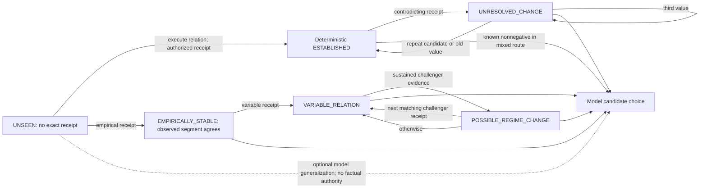

# Uncertainty map (Phase 1)

The graph shows information flow, not a guarantee that the agent will select a relation. The empirical `POSSIBLE_REGIME_CHANGE` confirmation can yield `EMPIRICALLY_STABLE` or `VARIABLE_RELATION` according to the new segment's observations; the diagram's `V` arrow denotes return to empirical assessment generally. The fold uses a frozen window and prior-count rule; this document does not propose new thresholds. [Deterministic fold](../../grounded_state/deterministic.py); [empirical fold](../../grounded_state/empirical.py); [assessment](../../grounded_state/core.py).

| State / interface | What creates it? | What evidence can change it? | Is evidence actively acquired? | If nothing happens? |
| --- | --- | --- | --- | --- |
| `UNSEEN` | No authorized exact-relation rows | First original authorized receipt for that `(state, action)` | Only if the action is selected and world executes it; the mixed route offers unseen actions but does not require selection | Remains `UNSEEN`; model generalization may influence selection but is not grounded fact |
| Deterministic `UNRESOLVED_CHANGE` | A receipt contradicts established `(next_state, consequence)` | A later exact-relation receipt matching old value restores it; matching challenger establishes new value; third alternative remains unresolved | Only through revisiting that relation; no scheduled revisit rule | Remains unresolved indefinitely, preserving ambiguity |
| Empirical `EMPIRICALLY_STABLE` | All observed outcomes in current segment agree | A different outcome makes the segment variable, or subsequent sustained challenger evidence opens possible change | Only by selecting the relation again | Label remains observation-relative; it never proves zero risk of another outcome |
| `VARIABLE_RELATION` | More than one outcome in current empirical segment | Additional receipts revise counts/frequencies; sustained challenger pattern may raise `POSSIBLE_REGIME_CHANGE` | No compulsory sampling | Frequencies and status freeze at observed evidence; no prediction about unseen future |
| `POSSIBLE_REGIME_CHANGE` | Frozen empirical prior/window detects a sustained challenger pattern | Next receipt matching challenger confirms segment switch; otherwise clears pending warning | No compulsory sampling of the relation | Warning remains pending; cannot resolve from time alone |
| Model generalization | Optional non-authoritative input on `UNSEEN` assessment | Actual authorized receipt displaces unseen status | Model may choose an admissible unseen action, but need not | Guess remains only a selection input, never Memory |
| Safe grounded fallback | Mixed route keeps best known deterministic relation alongside uncertain candidates; model selects known consequence ≥0 | A receipt on an uncertain alternative can reveal a comparison; repeated fallback receipts can strengthen only that known relation | No: model is permitted to keep choosing fallback | Same uncertainty remains. In Run C, HOLD's support count grew while ADVANCE and RETREAT stayed unseen. |

The [stochastic study](../grounded-stochastic-relation-v0/report.md) shows why empirical variability differs from deterministic contradiction: ordinary variable outcomes did not automatically mean regime change, while sustained observed patterns raised a bounded warning. Its paired histories had an indistinguishable observed prefix, so neither fold could know the different futures at that point. In the current action route, *all empirical kinds remain uncertain for ranking*, even if the assessment status string says `GROUNDED`; no empirical frequency is promoted to deterministic safe fallback. Lack of active acquisition is an action-policy property, not a defect in authenticated folding.
